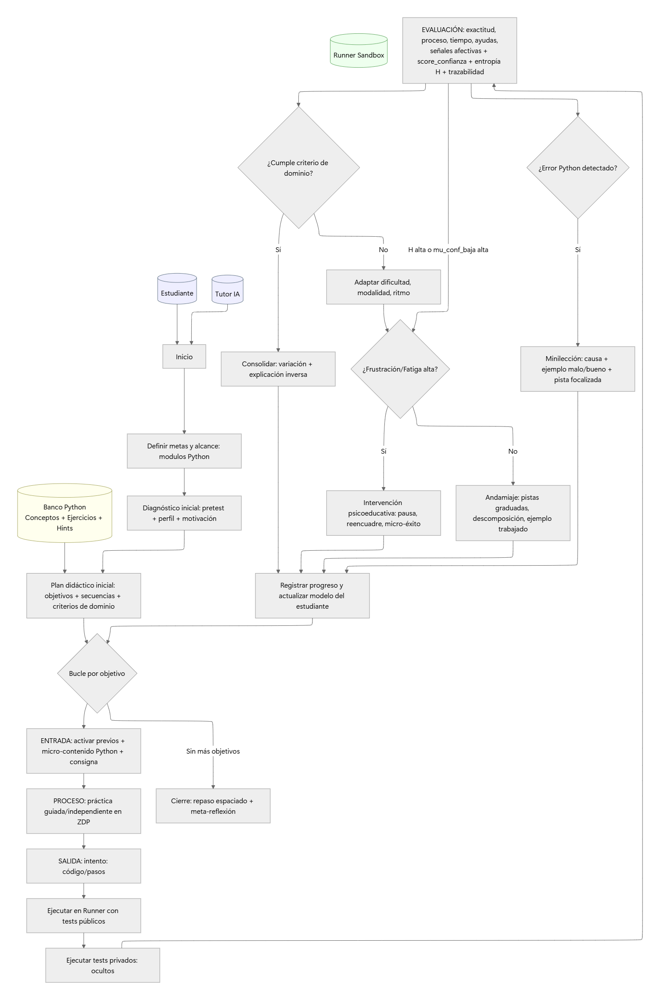

# Módulo 1 - Red de Procesos

## Propósito del componente
Este módulo describe el flujo general de interacción entre el estudiante, el tutor IA y los recursos del sistema. Su función es modelar el proceso didáctico, desde la definición de metas hasta la adaptación personalizada según el desempeño y el estado afectivo del estudiante.

## Entradas y salidas esperadas
- **Entradas:**
	- Perfil del estudiante (nombre, motivación, nivel inicial)
	- Preguntas o dudas del estudiante
	- Ejercicios y consignas seleccionados por el tutor
	- Resultados de los intentos del estudiante (código, tests)
- **Salidas:**
	- Plan didáctico personalizado
	- Ejercicios y microcontenidos adaptados
	- Feedback automático y pistas graduadas
	- Registro del estado del estudiante (maestría, confianza, frustración)
	- Intervenciones afectivas o psicoeducativas

## Herramientas utilizadas y entorno
- Python 3.x
- Neo4j (base de datos orientada a grafos)
- Docker y docker-compose para orquestación de servicios
- Librerías: `neo4j`, `langchain`, `pydantic`, entre otras

## Código relevante o enlaces a repositorio
- [llm_qa.py](../../../llm_qa.py): lógica de interacción entre el tutor y el estudiante usando LLM y grafo.
- [load_exercises.py](../../../load_exercises.py): carga de ejercicios al grafo.
- [tutorIA_final_full.cypher](../../../tutorIA_final_full.cypher): definición del modelo de grafo y relaciones pedagógicas.
- [diagrama_de_procesos.mmd](diagrama_de_procesos.mmd): diagrama de procesos en formato Mermaid.

## Capturas o ejemplos de funcionamiento
Puedes visualizar el diagrama de procesos aquí:

El flujo incluye:
- Diagnóstico inicial y definición de metas.
- Selección y entrega de ejercicios.
- Evaluación automática y registro de señales afectivas.
- Adaptación del plan según el desempeño y estado emocional.

## Resultados obtenidos (pruebas)
- El sistema genera un plan didáctico inicial y lo adapta dinámicamente.
- Se registran los intentos y el estado del estudiante en Neo4j.
- El tutor IA ofrece feedback y pistas según el desempeño detectado.
- Se han probado flujos completos de interacción, desde el diagnóstico hasta la intervención afectiva.

## Observaciones y sugerencias
- El modelo de procesos permite flexibilidad para agregar nuevos módulos o tipos de intervención.
- Se recomienda revisar y ajustar los umbrales de señales afectivas para personalizar aún más la experiencia.
- Futuras mejoras pueden incluir integración con dashboards de monitoreo y visualización de progreso.
