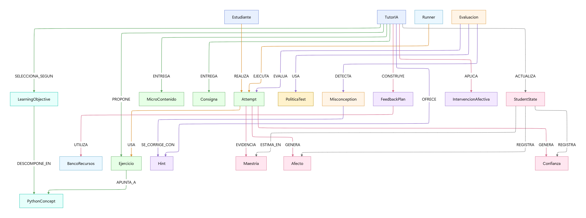

# Módulo 2 - Red Semántica

## Propósito del componente
Este módulo modela la red semántica de los conceptos de Python, sus relaciones y los recursos didácticos asociados. Permite representar y consultar el conocimiento estructurado del dominio, facilitando la selección de ejercicios, microcontenidos y pistas relevantes para el aprendizaje personalizado.

## Entradas y salidas esperadas
- **Entradas:**
	- Definición de conceptos de Python y sus relaciones (por ejemplo, desde archivos `.cypher`).
	- Ejercicios, consignas, microcontenidos y pistas a asociar a los conceptos.
	- Consultas sobre el grafo semántico (por ejemplo, desde el tutor o el sistema de recomendación).
- **Salidas:**
	- Subgrafos relevantes para una consulta o contexto de aprendizaje.
	- Listas de conceptos, ejercicios o recursos asociados a un tema.
	- Caminos semánticos entre conceptos para explicar relaciones o dependencias.

## Herramientas utilizadas y entorno
- Python 3.x
- Neo4j (base de datos orientada a grafos)
- Docker y docker-compose para orquestación de servicios
- Librerías: `neo4j`, `langchain`, `pydantic`, entre otras

## Código relevante o enlaces a repositorio
- [tutorIA_final_full.cypher](../../../tutorIA_final_full.cypher): definición de la red semántica y relaciones pedagógicas.
- [llm_qa.py](../../../llm_qa.py): lógica de consulta y recuperación de contexto semántico para el tutor IA.
- [red_semantica.mmd](red_semantica.mmd): diagrama Mermaid de la red semántica.

## Capturas o ejemplos de funcionamiento

El diagrama muestra:
- Nodos principales: conceptos, ejercicios, microcontenidos, consignas, estudiante, tutor, runner, etc.
- Relaciones pedagógicas y semánticas entre los nodos.
- Flujo de información desde la consulta del estudiante hasta la entrega de recursos personalizados.

## Resultados obtenidos (pruebas)
- Se puede consultar el grafo para obtener conceptos relacionados, ejercicios recomendados y rutas de aprendizaje.
- El sistema responde a consultas del tutor IA utilizando el contexto semántico del grafo.
- Se han verificado consultas de ejemplo y visualización de subgrafos relevantes para distintos temas.

## Observaciones y sugerencias
- La red semántica puede ampliarse fácilmente con nuevos conceptos, relaciones o recursos.
- Se recomienda mantener la consistencia en los nombres de los nodos y relaciones para facilitar las consultas.
- Futuras mejoras pueden incluir visualizaciones interactivas y métricas de centralidad o relevancia de conceptos.
