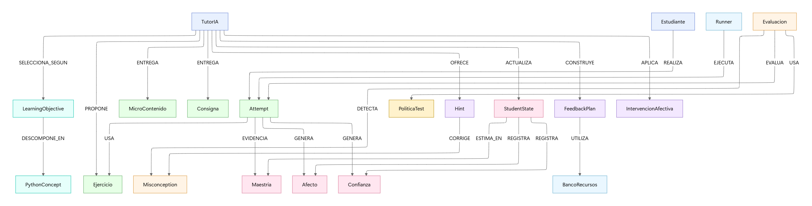
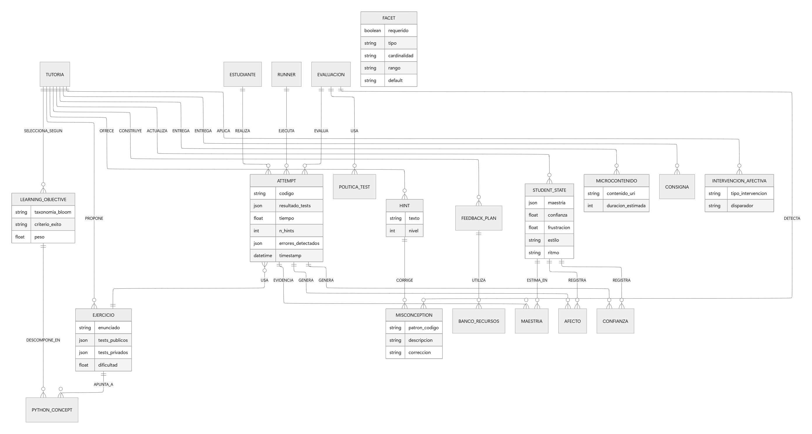
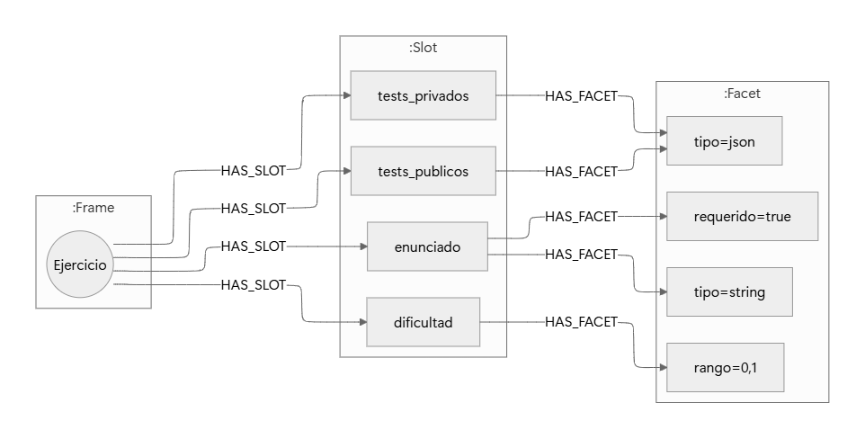

# Módulo 3 - Red de Frames

## Propósito del componente
Este módulo implementa la estructura de conocimiento basada en frames, modelando entidades clave del dominio educativo (como ejercicios, intentos, microcontenidos, estados del estudiante, etc.) y sus relaciones. Permite representar de manera flexible y extensible los distintos elementos y procesos pedagógicos, facilitando la integración de información y la adaptación personalizada.

## Entradas y salidas esperadas
- **Entradas:**
	- Definición de frames y sus slots (atributos) en el grafo Neo4j.
	- Datos de ejercicios, intentos, microcontenidos, intervenciones, etc.
	- Consultas sobre la estructura de frames y relaciones.
- **Salidas:**
	- Subgrafos o descripciones de frames y sus relaciones.
	- Listados de atributos (slots) y valores asociados a cada frame.
	- Visualizaciones de la estructura de frames y sus conexiones.

## Herramientas utilizadas y entorno
- Python 3.x
- Neo4j (base de datos orientada a grafos)
- Docker y docker-compose para orquestación de servicios
- Librerías: `neo4j`, `langchain`, `pydantic`, entre otras

## Código relevante o enlaces a repositorio
- [tutorIA_final_full.cypher](../../../tutorIA_final_full.cypher): definición de los frames, slots y relaciones en el grafo.
- [llm_qa.py](../../../llm_qa.py): lógica de consulta y recuperación de información estructurada usando frames.
- [load_exercises.py](../../../load_exercises.py): carga de ejercicios y sus atributos como frames y slots.
- [diagrama_frames.mmd](diagrama_frames.mmd): diagrama Mermaid de la estructura de frames.
- [red_frames.mmd](red_frames.mmd): diagrama de relaciones entre frames principales.
- [general_frames.mmd](general_frames.mmd): diagrama general de slots y facets.

## Capturas o ejemplos de funcionamiento
Puedes visualizar los diagramas de la estructura de frames aquí:

Estos diagramas muestran:
- Las entidades principales (frames) como Ejercicio, Attempt, Hint, Misconception, StudentState, MicroContenido, IntervencionAfectiva, etc.
- Los slots (atributos) asociados a cada frame y sus tipos.
- Las relaciones pedagógicas y de flujo de información entre los distintos frames.

## Resultados obtenidos (pruebas)
- Se ha verificado la correcta creación y consulta de frames y slots en Neo4j.
- Los diagramas generados permiten visualizar y validar la estructura del modelo de frames.
- El sistema responde a consultas estructuradas sobre frames, atributos y relaciones.

## Observaciones y sugerencias
- El modelo de frames facilita la extensión con nuevos tipos de entidades o atributos.
- Se recomienda mantener la consistencia en los nombres de frames y slots para facilitar las consultas.
- Futuras mejoras pueden incluir validaciones automáticas de integridad y visualizaciones interactivas de la red de frames.
