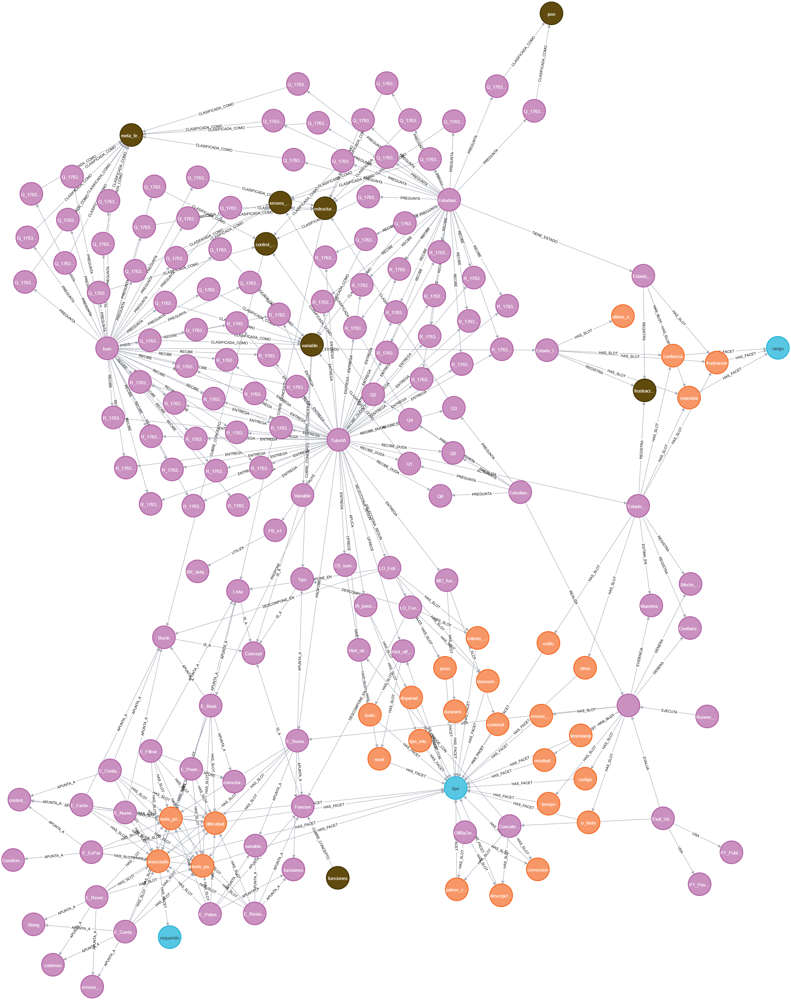
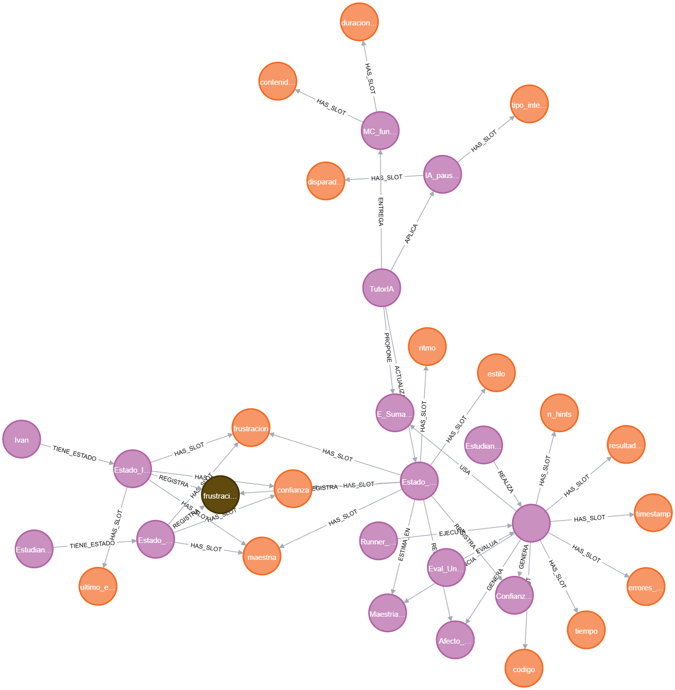

# Módulo 4 - Base Orientada a Grafos

## Propósito del componente
Este módulo implementa y gestiona la base de datos orientada a grafos (Neo4j) que almacena toda la estructura de conocimiento, relaciones pedagógicas y datos de interacción del sistema TutorIA. Permite modelar conceptos, ejercicios, intentos, estados y relaciones entre ellos de forma flexible y consultable.

## Entradas y salidas esperadas
- **Entradas:**
	- Definición de nodos y relaciones en Cypher (por ejemplo, desde [`tutorIA_final_full.cypher`](../../../tutorIA_final_full.cypher)).
	- Datos de ejercicios, intentos, microcontenidos, intervenciones, etc.
	- Consultas y operaciones de lectura/escritura desde los módulos Python.
- **Salidas:**
	- Subgrafos relevantes para consultas pedagógicas o de seguimiento.
	- Listados de conceptos, ejercicios, intentos y relaciones.
	- Visualizaciones del grafo completo o reducido según contexto.

## Herramientas utilizadas y entorno
- Python 3.x
- Neo4j (base de datos orientada a grafos)
- Docker y docker-compose para orquestación de servicios
- Librerías: `neo4j`, `langchain`, `pydantic`, entre otras

## Código relevante o enlaces a repositorio
- [tutorIA_final_full.cypher](../../../tutorIA_final_full.cypher): definición completa del modelo de grafo y relaciones.
- [llm_qa.py](../../../llm_qa.py): consultas y operaciones sobre el grafo desde Python.
- [load_exercises.py](../../../load_exercises.py): carga de ejercicios y nodos al grafo.

## Capturas o ejemplos de funcionamiento

Estas imágenes muestran:
- El grafo completo con todos los nodos y relaciones principales del dominio educativo.
- Una versión reducida del grafo, enfocada en los elementos y relaciones más relevantes para el seguimiento pedagógico.

## Resultados obtenidos (pruebas)
- Se ha verificado la correcta creación y consulta de nodos y relaciones en Neo4j.
- El sistema responde a consultas complejas y permite visualizar subgrafos relevantes para distintos módulos.
- Se han realizado pruebas de integración con los módulos de ejercicios, feedback y seguimiento de estado.

## Observaciones y sugerencias
- Mantener la consistencia en los nombres y tipos de nodos y relaciones facilita las consultas y la extensión del modelo.
- Se recomienda documentar las convenciones de modelado y actualizar los diagramas ante cambios estructurales.
- Futuras mejoras pueden incluir optimización de consultas y visualizaciones interactivas del grafo.
