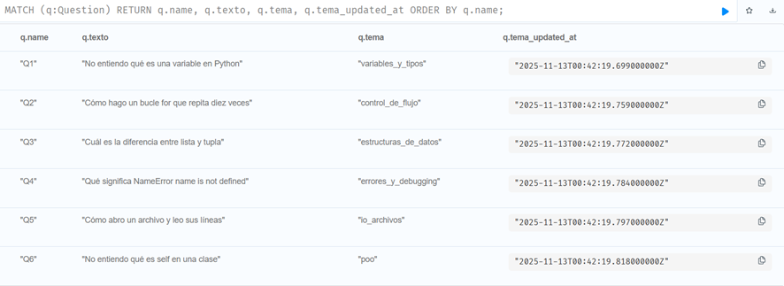
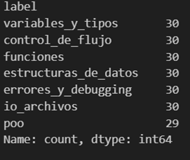
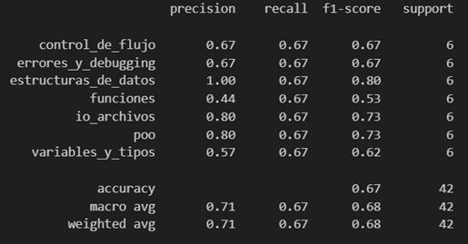
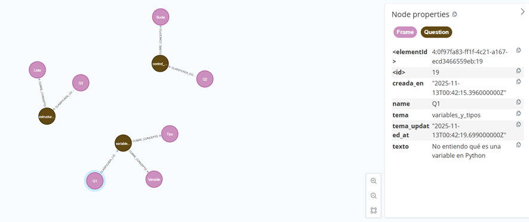
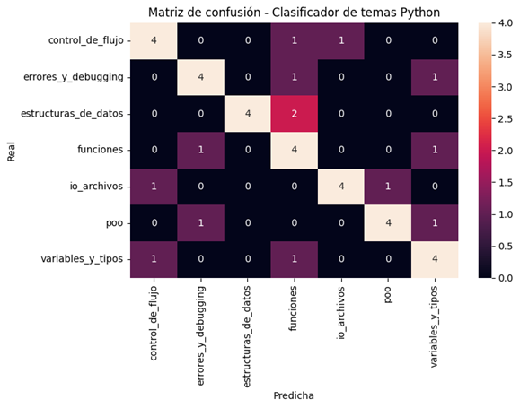

# Módulo 5 - Integración Módulo NLP

## Propósito del componente
Este módulo integra el procesamiento de lenguaje natural (NLP) para la clasificación automática de preguntas y la detección de temas en las dudas de los estudiantes. Su función principal es analizar el texto de las preguntas y asignarles un tema relevante del dominio Python, facilitando la personalización de la tutoría y la adaptación de los recursos didácticos.

## Entradas y salidas esperadas
- **Entradas:**
	- Texto de preguntas o dudas de los estudiantes.
	- Parámetros del modelo de clasificación de temas.
- **Salidas:**
	- Tema clasificado para cada pregunta (por ejemplo: variables_y_tipos, control_de_flujo, funciones, etc.).
	- Logs de clasificación y métricas de desempeño.

## Herramientas utilizadas y entorno
- Python 3.x
- scikit-learn
- joblib
- Neo4j (para almacenar resultados)
- Docker y docker-compose para orquestación de servicios

## Código relevante o enlaces a repositorio
- [clasificador_temas.py](../../../clasificador_temas.py): lógica de clasificación de temas usando NLP.
- [daemon.py](../../../daemon.py): integración del clasificador en el ciclo principal del sistema.
- [tutorIA_final_full.cypher](../../../tutorIA_final_full.cypher): ejemplos de preguntas y temas en el grafo.

## Capturas o ejemplos de funcionamiento
**Actualización de temas en Neo4j:**

**Listado de temas detectados:**

**Precisión del modelo de clasificación:**

**Ejemplo de grafo generado:**

**Matriz de confusión del clasificador:**

Estas imágenes muestran:
- El flujo de procesamiento desde la recepción de una pregunta hasta la asignación de un tema.
- Ejemplos de preguntas clasificadas y su correspondencia con los temas del grafo.
- Métricas de desempeño y visualización de resultados del modelo NLP.

## Resultados obtenidos (pruebas)
- El sistema clasifica automáticamente las preguntas nuevas y las asocia al tema correspondiente en Neo4j.
- Se han registrado logs de clasificación y métricas de precisión durante las pruebas.
- El daemon procesa preguntas pendientes y actualiza el grafo con los resultados del NLP.

## Observaciones y sugerencias
- Se recomienda actualizar y reentrenar el modelo de clasificación periódicamente con nuevas preguntas reales.
- Futuras mejoras pueden incluir la integración de modelos más avanzados de NLP y la visualización de estadísticas de clasificación.
