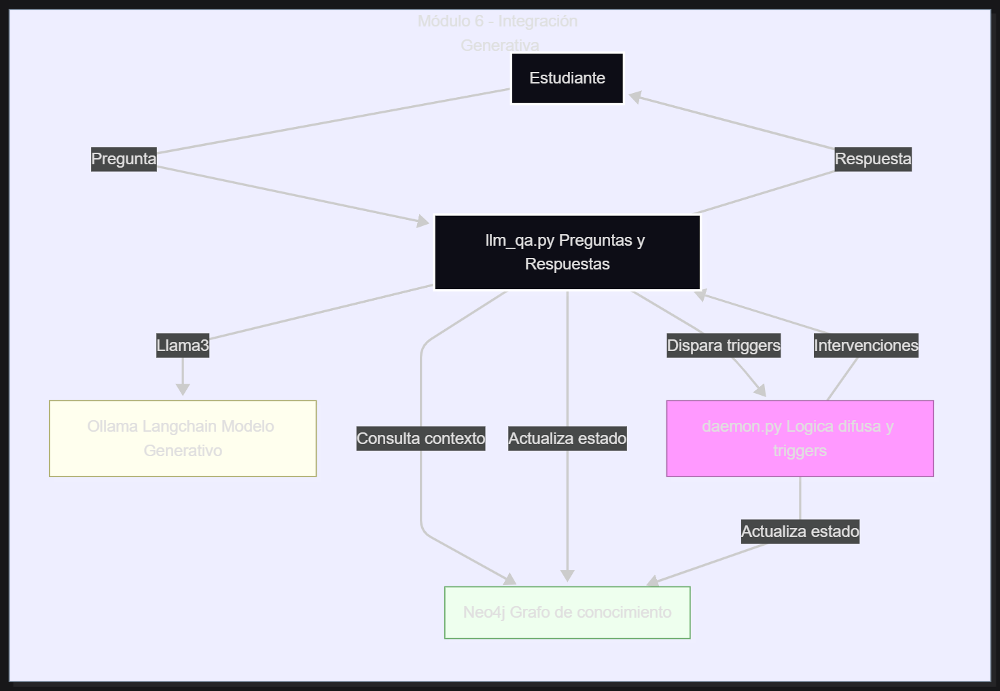
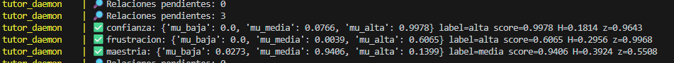
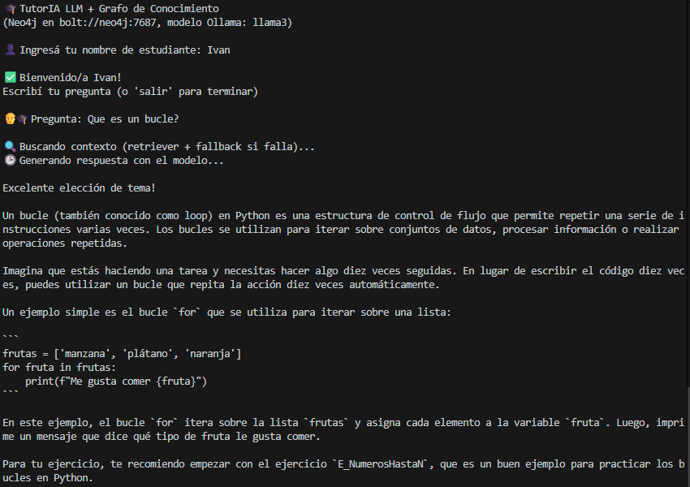

# Módulo 6 - Integración Módulo Generativo

## Propósito del componente
Este módulo integra el modelo generativo (LLM) para responder preguntas abiertas de los estudiantes y adaptar la tutoría de manera personalizada. Utiliza Ollama con el modelo `llama3` a través de Langchain y el archivo `llm_qa.py` para la lógica de preguntas y respuestas, recuperación de contexto y actualización del estado del estudiante. Además, emplea `daemon.py` para la lógica difusa y triggers pedagógicos, permitiendo intervenciones automáticas según el estado emocional y de maestría.

## Entradas y salidas esperadas
- **Entradas:**
	- Preguntas o dudas de los estudiantes.
	- Estado actual del estudiante (maestría, confianza, frustración) almacenado en Neo4j.
	- Parámetros de configuración y contexto del grafo.
- **Salidas:**
	- Respuestas generadas por el LLM (Ollama/llama3) a través de Langchain.
	- Recomendaciones de ejercicios personalizados.
	- Actualización del estado del estudiante y registro de preguntas/respuestas en el grafo.
	- Disparo de triggers e intervenciones afectivas según la lógica difusa.

## Herramientas utilizadas y entorno
- Python 3.x
- Neo4j (base de datos orientada a grafos)
- Docker y docker-compose para orquestación de servicios
- [Ollama](https://ollama.com/) con modelo `llama3`
- [Langchain](https://www.langchain.com/) para integración con LLM y recuperación de contexto
- `llm_qa.py`: lógica principal de preguntas/respuestas y actualización de estado
- `daemon.py`: lógica difusa, triggers y procesamiento en background

## Código relevante o enlaces a repositorio
- [`llm_qa.py`](../../../llm_qa.py): gestiona la interacción con el LLM, recuperación de contexto y actualización del grafo.
- [`daemon.py`](../../../daemon.py): ejecuta la lógica difusa y dispara intervenciones automáticas.
- [`tutorIA_final_full.cypher`](../../../tutorIA_final_full.cypher): definición del modelo de grafo y relaciones pedagógicas.

## Capturas o ejemplos de funcionamiento

**Diagrama de integración generativa:**

**Cambio de estado difuso:**

**Ejemplo funcionando:**

## Resultados obtenidos (pruebas)
- El sistema responde preguntas abiertas de estudiantes utilizando el modelo generativo `llama3` vía Ollama.
- Se adapta la dificultad de los ejercicios recomendados según el estado emocional y de maestría del estudiante.
- Se han verificado logs de actualización de estado y disparo de intervenciones automáticas por el daemon.

## Observaciones y sugerencias
- Es recomendable mantener actualizado el modelo Ollama y ajustar los prompts según los resultados observados.
- La integración con Langchain permite flexibilidad para cambiar el modelo o el proveedor LLM en el futuro.
- Futuras mejoras pueden incluir métricas de calidad de respuesta, integración con dashboards y visualización de triggers activados.
